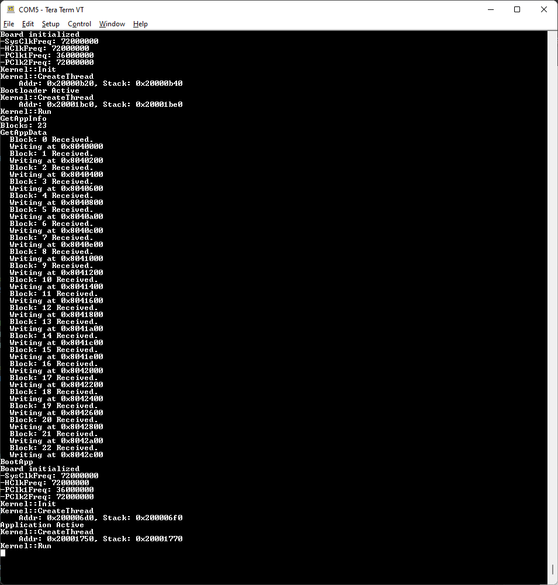

# stm32
Playing around with bare-metal STM32 (CMSIS only).

## Overview
* Bootloader + App
* Bootloader OTA update over UART (using Bluetooth/Hc06).
* Simple Kernel

### Boards
 * [NUCLEO-F746ZG](https://www.st.com/en/evaluation-tools/nucleo-f746zg.html)

### Drivers
* GPIO
* Simple UART
* SysTick
* Simple Timer
* Flash

## Demos

### Threading

### Updating

