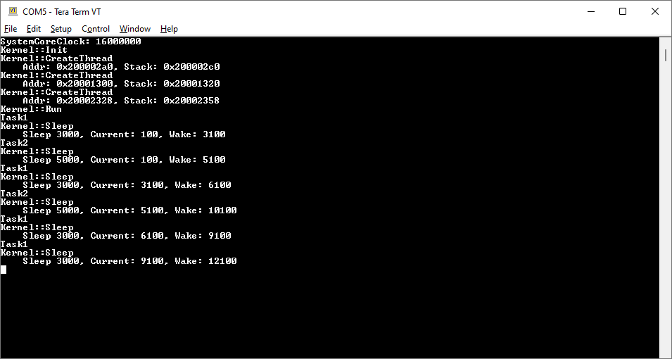

# stm32
Playing around with bare-metal STM32 (CMSIS only).

## Boards
[NUCLEO-F746ZG](https://www.st.com/en/evaluation-tools/nucleo-f746zg.html)

## Drivers
* GPIO
* Simple UART
* SysTick
* Simple Timer

## Threading
